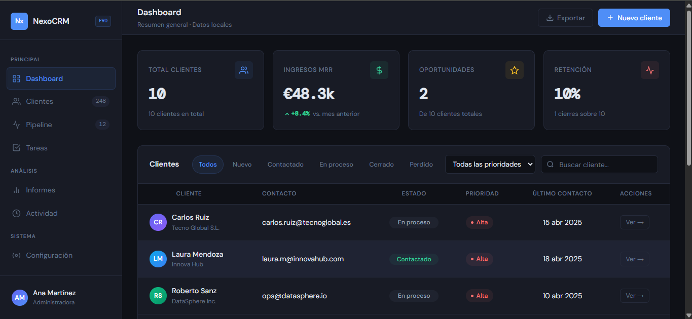
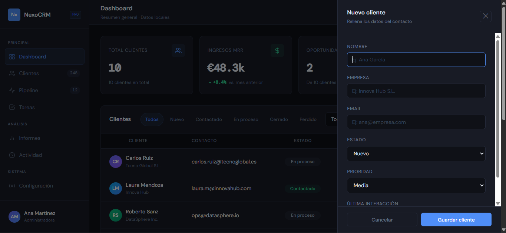
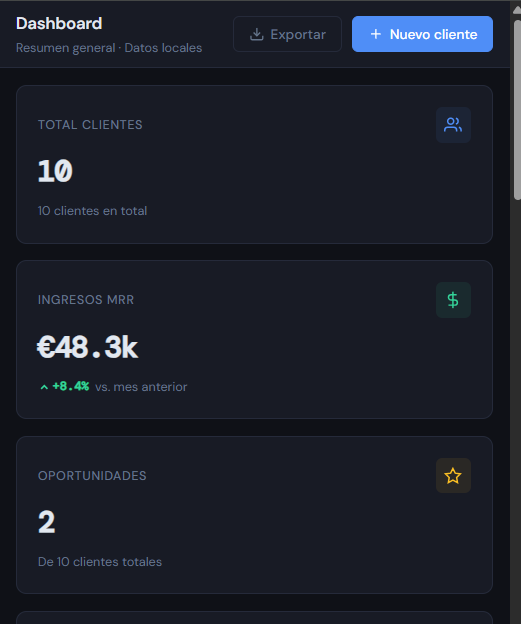

# NexoCRM

Mini CRM dashboard built with **HTML, CSS and vanilla JavaScript**.

NexoCRM simulates a small internal business tool where users can manage client records, filter data, update client statuses, validate form inputs and persist changes in the browser using localStorage.


## Live Demo
[View the live project](https://luisjim746.github.io/nexocrm/)

## Preview

### Dashboard
<p align="center">
  
</p>

### Add client form


### Mobile view
<p align="center">
  
</p>


## Why This Project Matters
This project was built to practice frontend logic commonly found in real business applications:

- dashboards
- data tables
- search and filters
- editable states
- forms
- validation
- browser persistence

The goal was to move beyond static layouts and build a more interactive, product-oriented frontend project.

## Technical Highlights

- Built with **vanilla JavaScript**, without frameworks
- Dynamic client table rendered from an array of objects
- Search by client name or company
- Multiple filters combined together: status and priority
- Inline status editing directly in the table
- Dynamic dashboard metrics
- Side panel form to add new clients
- Form validation with inline error messages
- Data persistence using localStorage
- Responsive layout for smaller screens
- Organized JavaScript logic separated from initial mock data

## Features

- Modern SaaS-style dashboard UI
- Client management table
- Search functionality
- Status filtering
- Priority filtering
- Inline client status updates
- Dashboard metrics
- Add-client form
- Form validation
- Persistent data with localStorage
- Responsive design

## Tech Stack

- HTML5
- CSS3
- Vanilla JavaScript
- Local Storage API

## Project Structure
```text
nexocrm/
├── index.html
├── styles.css
├── data.js
├── app.js
├── assets/
│   ├── nexocrm-dashboard.png
│   ├── nexocrm-form.png
│   └── nexocrm-mobile.png
└── README.md
```

### File Responsibilities

- `index.html` → application structure and layout
- `styles.css` → visual styles and component presentation
- `data.js` → mock client data used as the initial source of truth
- `app.js` → rendering, filters, metrics, form logic, inline editing, and persistence

## Key Learnings

This project helped me practice:

- DOM manipulation
- event handling
- rendering UI from arrays of objects
- combining multiple filters on the same dataset
- form handling and validation
- updating UI after state changes
- client-side persistence with localStorage
- structuring a larger vanilla JavaScript project in a more organized way

It also helped me understand a key frontend idea: the interface should reflect the current data, not the other way around.

## Challenges

Some of the main challenges in this project were:

- turning a static dashboard into a dynamic application
- keeping the table, filters, and metrics in sync
- handling multiple filters at the same time
- validating form data without overcomplicating the logic
- updating a client inline while preserving the current filtered view
- persisting changes in localStorage and reloading them correctly

## Reusable Patterns Practiced

This project includes several patterns that can be reused in future frontend work:

- array of objects as the source of truth
- data-to-UI rendering with `map()` and template literals
- filter pipeline with derived views
- shared UI state for filters
- capture → validate → save form flow
- inline data editing
- local persistence with `JSON.stringify()` and `JSON.parse()`
- small functions with a single responsibility

## Future Improvements

Possible next steps for a future version:

- edit full client details
- delete clients
- add sorting options
- improve accessibility
- split logic into smaller modules
- rebuild the project in React
- connect the app to a real backend and database

## Setup

To run the project locally:

1. Clone the repository
2. Open the project folder
3. Open `index.html` in the browser

You can also run it with a local server such as Live Server in VS Code.

## Author

Built by Luis Jiménez as part of a frontend development portfolio focused on HTML, CSS and JavaScript.
